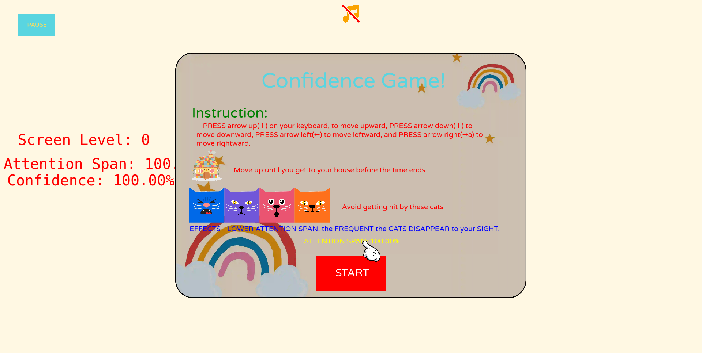
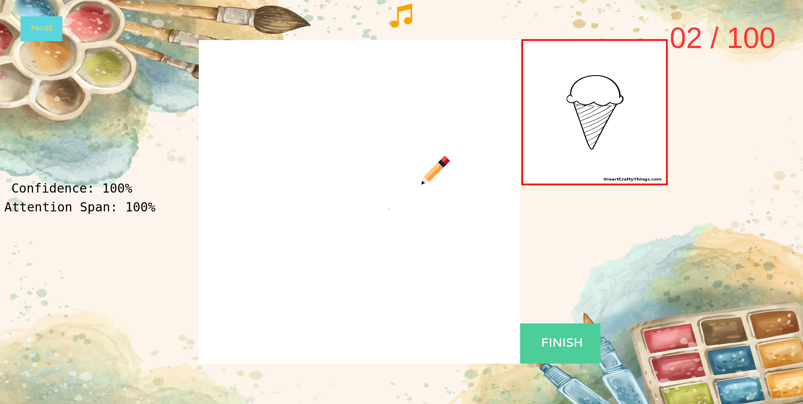
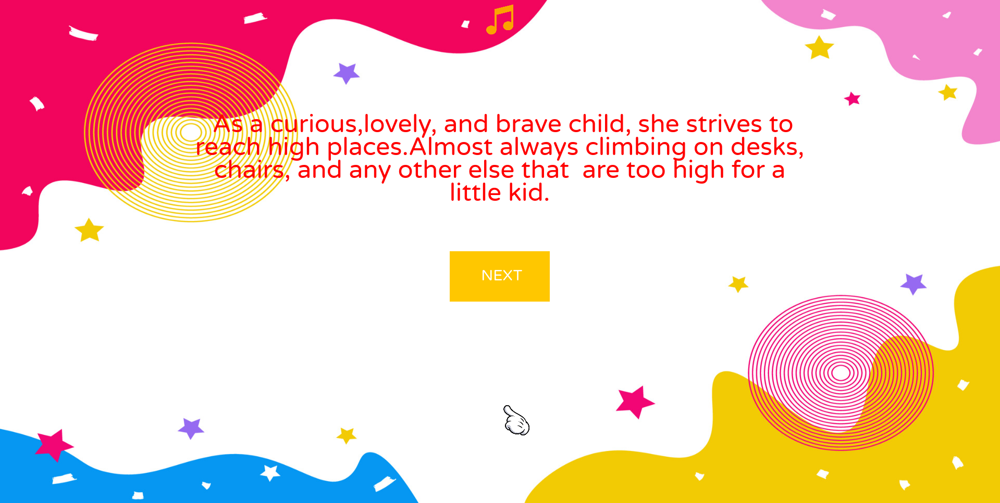

# Gabriella's Birthday Game 2024
  A kid friendly, simple story, and multi game type, that I made for my little sister named Gabriella on her birthday in the year of 2024.

  It is a game about what characteristics a strong kid have, and shows the effects on what will happen if you have less of those characteristics, how will affect your gameplay as you progress to different games.

  Play various games that vary its difficulty based on how you have played in the previous game you played.See colorful and kid friendly graphics that are fun.Listen to a wonderful song that I made yih hehehe.

  
  
  

  #### Key Features: 
  - Varying difficulties: Play on different difficulty based on how you played in the previous games.
  - Kid Friendly Graphics: Look at colorful, child friendly graphics.

  #### Tools Used:
  - Programming: HTML, CSS, and Javascript
  - Sound Production: <a href="https://www.soundtrap.com/">Soundtrap</a>
  - Sound Trimming: <a href="https://audiotrimmer.com/">Audio Trimmer</a>
  - Image Size Reduction: <a href="https://squoosh.app/">Squoosh</a>

  Play it here: <a href="#" style="text-decoration: underline">Gabriella's Birthday Game 2024</a>.
